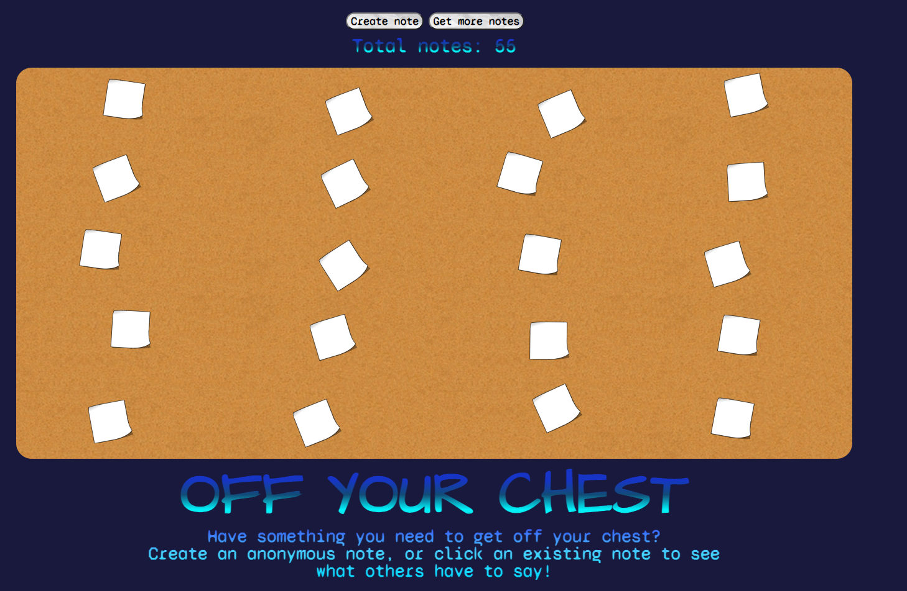

# NOTE WALL

## DESCRIPTION

A digital board to post anonymous notes, appropriate for all sentiments and occasions. Our app provides an online sanctum for safe expression in written form.

## TABLE OF CONTENTS

💿 [Installation](#installation)  
💻[Usage](#usage)  
📜[License](#license)  
👥[Contributors](#contributors)  

## INSTALLATION

##### Clone the Repository

Navigate to the [Note-Wall Repository](https://github.com/JesseJ713/Note-Wall). Copy the SSH connection from Github. Clone the repository onto your machine from your terminal using:

    git clone git@github.com:JesseJ713/Note-Wall.git

This will create the Note-Wall directory.

##### Install Dependencies

In your terminal, navigate into the Surveasy directory. To install all required dependencies, use:

    npm install

This will install all dependencies.

##### Running the application

Use the start script from the Surveasy directory to run the application:

    npm run start

In a dev environment, this will run the application on _localhost:8080_.

## USAGE

#### Create a note

From the landing page, click the _Create note_ button. This will allow the user to enter text and once submitted, will be stored in the database.

#### View a note

Notes are rendered onto a board that displays based off the user's screen size. Click any note you see fit to view the contents.

_All notes are anonymous!_

#### Get more notes

Click the _Get more notes_ button to refresh the board with a random selection of notes from the database.

## TECHNOLOGIES USED

* [MySQL](https://www.mysql.com/) - SQL Database
* [Sequelize](https://sequelize.org/master/) - Promise-based ORM for MySQL
* [Express.js](https://expressjs.com/) - Node.js framework 
* [Node.js](https://nodejs.org/en/) - JavaScript runtime
* [Handlebars](https://handlebarsjs.com/) - JavaScript Templating Language
* [Anime.js](https://animejs.com/) - JavaScript Animation Library

## LICENSE

## Contributors

<table>
<tr>
<td style="border: none">
  
##### Tyler S.
 
 

</td>
<td style="border: none">

##### Josh W.

</td>
</tr>

<tr>
<td style="border: none">

##### Jesse J.

 

</td>
<td style="border: none">

##### Desmond A.

 

</td>
</tr>
</table>
